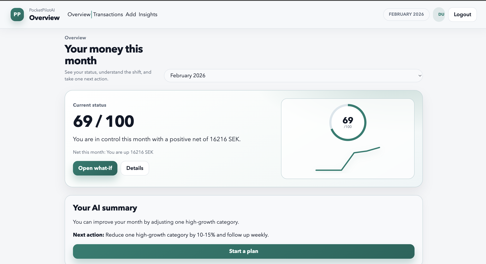

# PocketPilotAI

[](https://github.com/albinwarneryd1/PocketPilotAI/actions/workflows/ci.yml)
[](https://dotnet.microsoft.com/)
[](#license)

AI-powered personal finance assistant built with .NET MAUI + Blazor.


Track spending. Simulate scenarios. Make better financial decisions.

## ✨ Why PocketPilotAI?

PocketPilotAI helps users:

- Understand their monthly financial health instantly
- Simulate what-if scenarios before changing habits
- Receive AI-generated guidance instead of raw analytics

## 🚀 Core Features

- Financial Health Score (0-100)
- AI Monthly Narrative
- What-if Simulation Engine
- Smart Transaction Pattern Detection
- Decision-focused Insights
- JWT + refresh-token authentication (Web + MAUI)

## 📸 Screens

### Overview
<p align="center">
  
</p>

### Transactions
<p align="center">
  
</p>

### Add Transaction
<p align="center">
  
</p>

## 🧱 Tech Stack

- .NET 10
- ASP.NET Core Web API
- Blazor Web
- .NET MAUI (mobile/desktop)
- Entity Framework Core
- SQLite / SQL Server
- JWT + refresh tokens
- xUnit (unit + integration/API tests)

## 🧭 Architecture

PocketPilotAI follows a layered architecture:

- `Core`: Domain models, DTOs, interfaces, validation
- `Infrastructure`: EF Core persistence, services, AI integration, seed logic
- `API`: Auth, endpoints, middleware, OpenAPI
- `Clients`: Blazor Web + .NET MAUI app

The API is the source of truth. Web and MAUI share the same backend contracts and business rules.

## 🗂️ Project Structure

```text
PocketPilotAI/
├─ src/
│  ├─ PocketPilotAI.Core/
│  ├─ PocketPilotAI.Infrastructure/
│  ├─ PocketPilotAI.Api/
│  ├─ PocketPilotAI.Web/
│  ├─ PocketPilotAI.App/
│  └─ PocketPilotAI.Contracts/
├─ tests/
│  ├─ PocketPilotAI.UnitTests/
│  ├─ PocketPilotAI.IntegrationTests/
│  └─ PocketPilotAI.ApiTests/
├─ tools/scripts/
└─ .github/workflows/
```

## ▶️ Running Locally

### Prerequisites

- .NET SDK (see `global.json`)
- SQL Server (optional) or SQLite for local dev
- MAUI workloads if you want to run the app client

### 1) Clone + restore

```bash
git clone https://github.com/albinwarneryd1/PocketPilotAI.git
cd PocketPilotAI
dotnet restore PocketPilotAI.sln
```

### 2) Start API (local SQLite, no paid services required)

```bash
export ASPNETCORE_ENVIRONMENT=Development
export Database__Provider=sqlite
export ConnectionStrings__DefaultConnection="Data Source=$PWD/pocketpilotai.local.db"
export POCKETPILOTAI_JWT_KEY="replace-with-a-long-random-secret"
export DEMOSEED__ENABLED=true

dotnet run --project src/PocketPilotAI.Api --urls https://localhost:7174
```

### 3) Start Web client

```bash
dotnet run --project src/PocketPilotAI.Web
```

Open: `https://localhost:7113`

### 4) Start MAUI (MacCatalyst)

```bash
export POCKETPILOTAI_API_BASE_URL="https://localhost:7174"
dotnet build src/PocketPilotAI.App/PocketPilotAI.App.csproj -f net10.0-maccatalyst -c Debug
open src/PocketPilotAI.App/bin/Debug/net10.0-maccatalyst/maccatalyst-arm64/PocketPilotAI.app
```

## 🔐 Authentication Flow

- Register/login via API (`/api/auth/register`, `/api/auth/login`)
- API returns access token + refresh token
- Access token secures API calls (`Authorization: Bearer ...`)
- Refresh token is rotated via `/api/auth/refresh`
- Token storage:
  - Web: session state
  - MAUI: secure storage on device

## 🤖 AI Features

- Leak detection: finds categories with highest savings potential
- Monthly summary: plain-language financial narrative
- What-if simulation: scenario templates with KPI deltas

Deterministic math (KPIs, deltas, forecasts) is always calculated server-side. AI is used for explanation and recommendation text.

## 🧪 Tests

Run all tests:

```bash
dotnet test PocketPilotAI.sln -c Release
```

Run specific suites:

```bash
dotnet test tests/PocketPilotAI.UnitTests/PocketPilotAI.UnitTests.csproj -c Release
dotnet test tests/PocketPilotAI.ApiTests/PocketPilotAI.ApiTests.csproj -c Release
```

## 🔮 Next Steps

- Stronger recommendation ranking and confidence logic
- Advanced scenario builder with multi-step plans
- Richer analytics dashboards
- Export/reporting support
- Open Banking integrations

## 🖼️ Screenshot Assets

Place screenshots in:

- `assets/screenshots/hero-overview.png`
- `assets/screenshots/overview.png`
- `assets/screenshots/transactions.png`
- `assets/screenshots/add-transaction.png`

## License

TBD.
